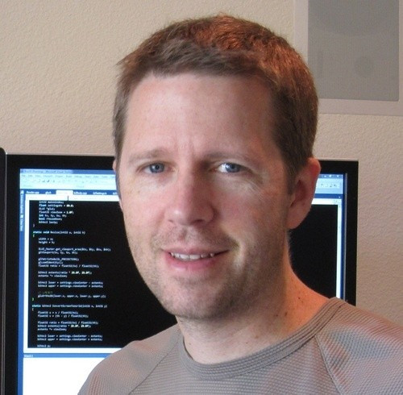
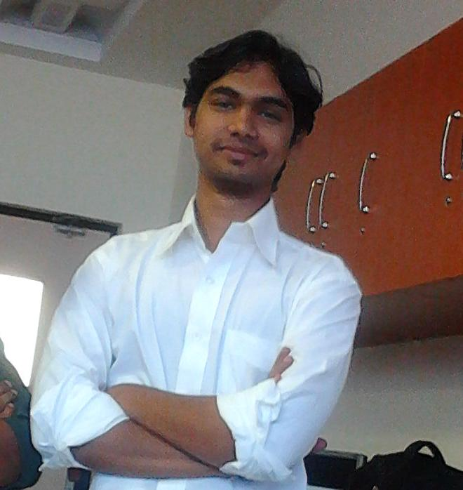
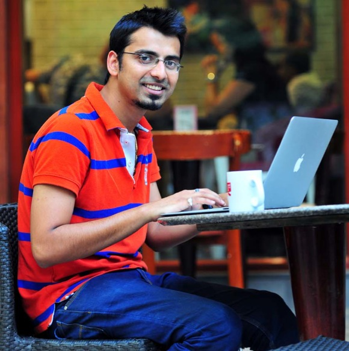
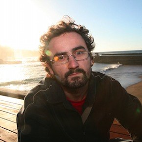
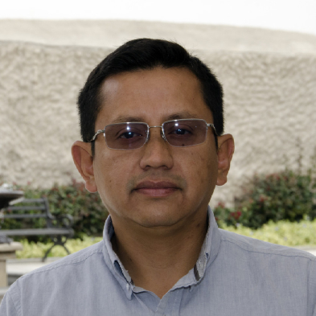

Venture
========

**Product:** 
Wordpress Studio

**Positioning Statement:**
For developers, designers, and operators who are hands on with Wordpress source code, Wordpress Studio is a single
interface to a suite of development tools that allow users to easily create and customize applications built using
the Wordpress content management system. Unlike language specific IDE's or disjointed tools, Wordpress Studio aims
to provide a very focused and complete set of tools that tackle Wordpress specific development obstacles.

Personas
========

----------------------------
Rhonda (Freelance Developer)
----------------------------

**Screening Question:**
How many hours per week do you spend writing or troubleshooting code for Wordpress? (more than 8)

Rhonda is a self taught programmer. She lives in New York and works mostly in PHP. She began offering contract services
working on Wordpress sites after learning how to program her own site. She does a bit of plugin customizations, theme
customizations, and has even built an event booking plugin that she has uploaded to the Wordpress directory.

She lives in a studio apartment with her small dog Rocket. He is an australian terrier with a big attitude. Since she
works from home, Rocket loves to camp out at the edge of the couch right next to Rhonda's workstation and wait for her
to get up so he can entice her to play with him.

Rhonda loves the fact that she makes her own hours, and she has been able to secure a few deals with clients that 
ensures that she stays busy for at least 25-30 hours a week. She usually works another 10-20 additional hours each
week on odd jobs from client referrals and leads she generates from her Wordpress plugin.

> **Thinks:**
Rhonda has ideas of one day improving her event booking plugin and selling a version of it as a premium offering. It
would be nice to have an additional income stream and a polished product that she could show off when talking to new
clients.

> **Sees:**
Rhonda sees a wide range of different code qualities and styles as she troubleshoots issues for clients and customizes 
site functionality. It's easy to tell when a theme or a plugin has been professionally developed. Some of her most 
frustrating experiences are when she is asked to modify the functionality of a poorly written plugin/theme.

> **Feels:**
Rhonda likes Wordpress because most of the work she needs to complete already has a solution in the form of a plugin or
a code example that she can find on Stack Overflow or a similar site. Finding new solutions to problems causes her to 
feel a bit of pressure sometimes when she can't find an appropriate example. She feels like her code is sometimes a bit
hacky, but it always gets the job done.

> **Does:**
When making customizations for clients, she will usually just add some functions to the theme to get the job done. She 
knows that the code could be better off in its own plugin and that it could be organized a bit better, but her clients 
dont have unlimited budgets and coming up with structured approaches is a difficult task. She often finds herself just
copying code she wrote previously to solve similar problems on different client sites.

-------------------------
Darian (Junior Developer)
-------------------------

**Screening Question:**
How many hours per week do you spend writing or troubleshooting code for Wordpress? (more than 8)

Darian is a university graduate with a computer science degree. Most of his early experience programming was in python
while working on school projects, with some exposure to PHP since he maintained his school band website which was built
with Wordpress. 

He can play the guitar, drums, tuba, and clarinet. His favorite instrument is the guitar, although he is planning on 
adding the saxaphone to his repertoire if he can find the time. He earned the directors award for outstanding performance 
3 out of his 4 high school years.

Darian currently works for ShopConnect, a company providing turn key ecommerce solutions for franchisees that also do
business online. His biggest client is a chain of pet accessory retail stores that all run on WooCommerce. As a new
developer, he is most excited to learn how to build software from the ground up. His company has developed and maintains
8 different commercial WooCommerce plugins.

> **Thinks:**
Darian knows that he has a lot to learn and plans to become experienced enough in his craft to take on the role of a 
senior developer or a team lead. He is confident in his abilities as a developer and has always been good at picking up
new concepts.

> **Sees:**
The senior developers at his company are always talking in abstract ways and in terms of "design patterns". A lot of 
their time is spent discussing how to approach a problem before they even get down to coding a solution. Then before a
code commit is merged into the main branch, there is always a final review by another developer to ensure nothing obvious 
is being overlooked.

> **Feels:**
Darian wants to make valuable contributions to the software that his company develops. He's already learned a lot and 
is excited to apply his knowledge about coding at a high level to the existing products that he is helping to maintain.
He is a bit apprehensive about the code he writes sometimes because he doesn't want to introduce technical debt into
the project or be responsible for any major bugs.

> **Does:**
Darian mostly follows the examples set by his senior team members. When he creates some new code, he'll run a manual test
against his development site and then commits under good faith that his solution doesn't create any other bugs in the
system.

________________________

### Problem Scenarios

* __Developing using Modern Design Patterns__

  1. Wordpress lacks any fundamental OOP architecture
     - *Alternative:* Use namespaced functions or hand roll classes and use includes
	 - *Value-Proposition:* Provide a base OOP framework with automatic PSR-4 autoloading
  2. Implementing modern design patterns requires extra work
     - *Alternative:* 
     - *Value-Proposition:* 
  3. Using code samples found online is crufty and buggy
     - *Alternative:* 
     - *Value-Proposition:* 
  4. Writing and running tests is an afterthought
     - *Alternative:* 
     - *Value-Proposition:* 
 
* __Inspecting/Understanding Call Stacks__

  5. Finding all actors on filters/hooks is a chore
     - *Alternative:* 
     - *Value-Proposition:* 
  6. Visualizing the heirarchy of hook stack execution is difficult
     - *Alternative:* 
     - *Value-Proposition:* 
  7. Discovering code based bottlenecks is time consuming
     - *Alternative:* 
     - *Value-Proposition:* 
 
* __Grouping Code Change Commits__

  8. On the fly refactors and fixes lead to unclear/muddy code commits
     - *Alternative:* 
     - *Value-Proposition:* 
 
* __Implementing WP Code Patterns__

  9.  Naive solutions often lead to incompatibilities and bypassed subsystems
      - *Alternative:* 
	  - *Value-Proposition:* 
  10. Naive solutions often lead to security vulnerabilities
      - *Alternative:* 
	  - *Value-Proposition:* 

---------------------------
Edwin (Senior IT Developer)
---------------------------

**Screening Question:**
How many new clients do you aquire yearly who need custom Wordpress applications developed. (3 or more)

Edwin works for a 20 person IT development company. A typical project for them involves 3-5 people working on a 
project and typically lasts 6-12 months, though they're sometimes called upon to squeeze in a quick (1 month) project 
and they also have some long term customers for which they maintain apps that they've built in the past.

Edwin enjoys flying his Phantom 4 drone on the weekends and moonlights as an amateur photographer. He's outfitted his
drone with a few extra upgrades that gives it extra flight time. His girlfriend jokes about him not being able to fly
it straight even though it has auto pilot.

Most of the work he has done in the past has been ASP/C#/Java, and based on corporate networks. But recently, his company 
has shifted into the world of linux application development, with a significant amount of work coming from clients with 
websites running on LAMP stacks that need custom development work. 1 out of 4 new clients require some sort of custom 
Wordpress development.

> **Thinks:**
Edwin knows that a large part of the web is built on linux servers and understands that with the advancement of on
demand computing resources, a lot of potential clients are moving from in-house IT infrastructures to cloud based
infrastructures, and also making the switch over to open source software solutions rather than those that are home
grown or proprietary.

> **Sees:**
Edwin sees that there is a very large range of different technologies being used in the web application world. He
also sees that most of the options available for open source content management systems are built using PHP. He has
heard that PHP is a sloppy language and that it is like using a hammer to do the job of a screwdriver. After
reviewing a handful of code examples and wordpress plugins, he is convinced that it is a bunch of monkey's who have
been holding that hammer.

> **Feels:**
Edwin is used to clearly defined software architectures and specifications for outcomes. He is fearful that his team
will be lured into sloppy habits and difficult to maintian solutions as they are becoming experienced in the trade
of LAMP stack development, and specifically since a fair amount of work that they will be doing is on the Wordpress
platform.

> **Does:**
In the past, Edwin has outsourced the small amount of development work they have needed to do for clients that fell
outside the range of their expertise. Now that they are bringing that work in house, he is working with some of the other
experienced engineers on his team to come up with a framework that they can use moving forward with new projects.
________________________

### Problem Scenarios

* __Structure & Framework__

  11. Creating a new framework to build on just for Wordpress is not ideal
      - *Alternative:* 
      - *Value-Proposition:* 
  
* __Analyzing Code Performance Issues__

  12. Finding/optimizing slow hooks/filters is difficult
      - *Alternative:* 
      - *Value-Proposition:* 
  13. Finding/optimizing slow database queries is boring
      - *Alternative:* 
      - *Value-Proposition:* 
  
* __Troubleshooting Inter-plugin Compatibility Bugs__

  14. Finding bugs caused by interactions between plugins
      - *Alternative:* 
      - *Value-Proposition:* 
  
* __Auditing For Security Vulnerabilities__

  15. Finding instances of outputting unsanitized user input
      - *Alternative:* 
      - *Value-Proposition:* 
  
---------------------------------
Abdul (Software Architect)
---------------------------------

**Screening Question:**
How many hours per week do you spend writing or troubleshooting code for Wordpress? (more than 8)

Abdul enjoys contemplating the big picture and solving problems abstractly. Whenever he is presented with a problem,
he wants to find a solution that can be re-used and applied in as many situations as possible. When he began working 
for his current employer, one of the first things he did was to create and document a set of new development tools to 
help his team function at a higher level.

Abdul is pushing 40 years old, and as a middle aged adult, he is finding it tougher to stay fit. He enjoys being outdoors 
and boating, and has recently started a new diet challenge in hopes of gaining back some of his youthfulness.

He is currently working on a new project at work with the goal of positioning his company as a major player and solution
provider in a growing market of Wordpress developers. The plan is to architect an extensible development tool that runs
on Wordpress itself, and that can support a scaling up of add-ons to it as the product matures.

> **Thinks:**
Abdul sees an opportunity in the current Wordpress landscape to address the need for a more comprehensive set of development
tools that can help all developers involved with wordpress to be more effective and productive. He believes that it is also
an opportunity to help his company make a name for itself in the Wordpress development community.

> **Sees:**
Abdul sees a lot of great tools that are available to developers using Wordpress, as well as quite a few gaps and fundamental
deficiencies in the platform. But even the tools that are available are segmented between different products, services, and
environments.

> **Feels:**
Abdul feels like the general quality of software produced for the Wordpress platform could be improved greatly if there 
were a better set of tools and patterns available to guide and bootstrap new projects. It also makes him happy when he can
achieve a core consistency between all of the projects he works on.

> **Does:**
Abdul creates new interfaces around core wordpress functionality that is better suited to integration with modern object
oriented design patterns so that good programming habits can be encouraged within his team.
________________________

### Problem Scenarios

* __Bootstrapping New Plugins__

  16. Starting a plugin without an existing framework is difficult
      - *Alternative:* 
      - *Value-Proposition:* 
  17. Starting a plugin by editing a plugin template is a chore
      - *Alternative:* 
      - *Value-Proposition:* 
 
* __Designing Data Models__

  18. Correctly modeling data with object patterns is a repetitive and time consuming chore
      - *Alternative:* 
      - *Value-Proposition:* 
  19. Maintaining consistency between multiple developers in a team requires a lot of auxilary effort
      - *Alternative:* 
      - *Value-Proposition:* 
	 
* __Leveraging MVC & MVVM__

  20. Scaffolding a new template system for each new project is laborious and wasteful
      - *Alternative:* 
      - *Value-Proposition:* 
  21. Creating scalable architectures that can be maintained over many cycles is very difficult
      - *Alternative:* 
      - *Value-Proposition:* 
	 
* __Managing Database Schemas__

  22. Writing sql scripts to manage database table versions is a pain
      - *Alternative:* 
      - *Value-Proposition:* 
  23. Keeping multiple development environments in sync with schema changes is challenging
      - *Alternative:* 
      - *Value-Proposition:* 
	 
* __Managing Compatibility Tradeoffs__

  24. Keeping on top of compatibility and deprecation issues for new and existing code is tedious
      - *Alternative:* 
      - *Value-Proposition:* 
  
* __Testing Coverage__

  25. Bootstrapping tests / Creating testing harnesses
      - *Alternative:* 
      - *Value-Proposition:* 
  26. Writing tests
      - *Alternative:* 
      - *Value-Proposition:* 

-------------------------  
Eshan (Graphic Designer)
-------------------------

**Screening Question:**
Have you created any themes for a wordpress site within the last 3 months? (1 or more)

Eshan is the lead designer at a contract web development firm in San Jose. He has a degree in graphic design and divides 
his time between Photoshop/Illustrator and HTML/CSS. Lately, he has been learning to code his HTML/CSS designs as Wordpress
themes since a majority of the clients he works for have sites built on Wordpress.  

Eshan works on a Mac exclusively. On his way into the office, he grabs coffee from the barista next to his apartment. He 
enjoys the fact that he only has a 20 minute commute each way. He only buys shoes that are black or white so that they
don't clash with any of the other clothes in his wardrobe.

There are three other developers at his firm that usually do the coding for the functionality that is needed to power the
themes he creates. 

> **Thinks:**
Eshan knows that being able to create fully coded Wordpress themes is a great skill to have. Besides being able to provide
additional value to his current employer, having the ability to create standalone themes on his own could help him further
down the road of his career also.

> **Sees:**
Eshan sees the enormous market that is available for Wordpress themes. He also sees that there is a wide range of quality
in themes available for the Wordpress CMS. He has heard that the best way to develop a theme is to build from an existing
framework so that many fundamental problems are already solved for you.

> **Feels:**
Eshan feels a little overwhelmed with the "patterns" introduced by the theme frameworks he is looking at. He knows that 
they will provide him a solid foundation for his themes, but this is all fairly new to him and he wants to be able to do 
things correctly.

> **Does:**
Eshan mostly looks at other themes that he thinks are good examples and tries to learn from them and model his code after
them.

________________________

### Problem Scenarios

* __Bootstrapping New Themes__

  27. Creating and customizing new theme scaffolding is a barrier to creativity
      - *Alternative:* 
      - *Value-Proposition:* 
  
* __Finding Proper Hook Points__

  28. Finding where certain output is being generated from is challenging
      - *Alternative:* 
      - *Value-Proposition:* 
  
* __Implementing WP Code Patterns__

  29. Implementing solutions for basic problems impedes the creative process
      - *Alternative:* 
      - *Value-Proposition:* 
  
--------------------------------
Marvin (Project Manager/Team Lead)
--------------------------------

**Screening Question:**
How many projects do you complete on wordpress each month? (4 or more)

Marvin manages a team of 6 developers in house, and another 3-5 at any given time as outsourced contractors for his 
company, WPIntegrate. He used to be a full time software developer, but most of his time is now dedicated to managing 
the new and existing projects that the sales team brings in for development.

His favorite color is blue. His favorite drink is tequila. Sometimes when the team goes out to lunch together, he likes
to order a blue curacao if they eat at the taqueria across the street from the office. He's very happy that his team 
gets along so well and is proud of the culture they have.

On any given day, Marvin may have both physical and/or virtual meetings with clients being onboarded, follow up meetings
with existing clients, meetings with the development team, and communications with other stakeholders such as sales and
ownership regarding project updates. WPIntegrate deals almost exclusively with building custom wordpress plugins for 
outside companies who want to provide their own Wordpress plugins but offload the development work.

________________________

### Problem Scenarios

* __Code Quality Review Processes__

  30. Understanding the full range of code in a project requires constant review
      - *Alternative:* 
      - *Value-Proposition:* 
  31. Common mistakes made by junior devs costs additional time in reviews and refactorings
      - *Alternative:* 
      - *Value-Proposition:* 
  
* __Product Lifecycle Management__

  32. Product versioning and build management is a bane
      - *Alternative:* 
      - *Value-Proposition:* 
  
* __Product Distribution Management__

  33. Distributing premium products and keeping clients up to date is chalk full of obstacles
      - *Alternative:* 
      - *Value-Proposition:* 

---------------------  
Samuel (Site Operator)
---------------------

**Screening Question:**
Do you perform maintenance on your own Wordpress site? How many times do you touch the code each month? (Yes, 1 or more times)

Samuel runs the most popular site for Sao Paulo's music scene and nightlife. If there's music playing anywhere in Sao Paulo, 
Samuel's site has got the scoop. It has an events calendar, photo galleries, videos and a blog with articles and interviews.

Samuel uses a Windows computer exclusively.

Through the years of running his site, Samuel has learned how to bend WordPress to do what he wants. He has had outside help 
with the graphic design, but he has done everything else himself, relying heavily on WordPress and jQuery plugins to get the 
desired effect.

Samuels's site already has a mobile presentation, but he knows that many people rely on mobile apps rather than the browser. 
He would like to have an app that lets people submit photos, can receive push notifications about big events and can have a 
snappier, more responsive feel than his mobile website. 

> **Thinks:**
Samuel isn't really concerned about having the fastest site in the world, he just cares that it works. He knows that there
are probably a lot of things that could be optimized to make his site run faster and avoid some of the hiccups it has, but
he doesn't want to pay a lot of money to a consulting/development firm to come in and re-do his site.

> **Sees:**
Samuel has been to a couple of Wordpress meetups in Sao Paulo to talk with other site operators. He sees that they have spent
thousands of dollars to have development work on their sites and they also suffer from some of the same ineffeciencies that
his does.

> **Feels:**
Samuel feels good that he is able to make updates to his own site and even make the customizations necessary to make things
work the way he wants to. When he can do the work that he knows would normally cost him hundreds of dollars to outsource, it
gives him motivation to learn more.

> **Does:**
Samuel searches Google any time he needs to make a site customization. He'll normally just copy any paste code into his theme
file and then tweak it until he achieves the desired effect. Sometimes he can't get the first solution he finds to work so 
he just works down the list of solutions he finds online until he can get one of them to work.
________________________

### Problem Scenarios

* __Optimizing Performance__

  34. Understanding which plugins are responsible for speed bottlenecks is next to impossible
      - *Alternative:* 
      - *Value-Proposition:* 
  
* __Customizing Functionality__

  35. Finding quick solutions to simple problems is never quick
      - *Alternative:* 
      - *Value-Proposition:* 

----
